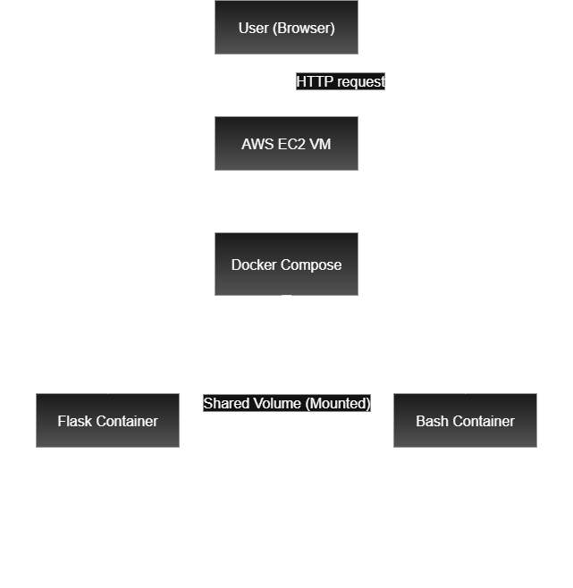

# Multi service docker flask project
 
   - This is a mini DevOps project demonstrating how to build corodinate multiple Dockerized services using docker-compose and individual dockerfiles.
   - The project conatains three services or containers that work together via a shared volume, and it is deployed on AWS EC2 using SSH. 

----

# Project structure

```
   flask-final/
           |
           |__scripts/
                   |___system_info.sh
           |
           |       |___logger.sh
           |
           |       |___dockerfile
           |
           |__flask/
                   |___app.py
           |
           |       |___requirements.txt
           |
           |       |___dockerfile
           |
           |__shared_vol/    #(auto created via docker volume, excluded grom git)                                                                                                                                                                                                                                                                                                                                                                                                                                  ## How to run                                                                                                                                                                                                                                                                                                                                                                                                                         ```bash                                                                                                                                                                                                            bash scripts/system_info.sh                                                                                                                                                                                        ```                                                                                                                                                                                                                ```bash                                                                                                                                                                                                            bash scripts/logger.sh                                                                                                                                                                                             ```                                                                                                                                                                                                                ```python                                                                                                                                                                                                          python flask/app.py                                                                                                                                                                                                ```                                                                                                                                                                                                                ```bash                                                                                                                                                                                                            bash docker-compose.yml                                                                                                                                                     

           |__docker-compose.yml
           |
           |__README.md
           |
           |__.gitignore
```

----

## How it works

   - Service 1: system_info.sh

              - Greets the user ( whoami )
 
              - Captures system info ( hostname, uptime )

              - Writes output to a shared volume

   - Service 2: logger.sh

              - Reads shared volume data

              - Appends it to system_info.log with tamestamp

   - Service 3: Flask app

              - Reads system info from the shared volume

              - Displays it via a simple flask web interface on port 5000

----

# Deployment

   - The app is containerized using docker using docker and run using docker-compose

   - Deployed on an AWS EC2 instance

   - Accessed via browser:
     http://<your-public-ip>:5000

----

## How to run

  - git clone https://github.com/yourname/project.git

  - cd project

  - docker-compose up --build

----

## Note

   - Temporary files, Python caches, Logs, and shared volume data are excuded using .gitignore

   - The project is safe and does not modify your host system

   - Ideal for learning Docker, Flask, bash scripting, and multi-container architecture

----

## Highlights

- Set up EC2 and handled port/firewall issues

- Docker Compose with shared volume communication

- Debugging Docker build errors and Flask app routes

----

## Architecture Diagram


